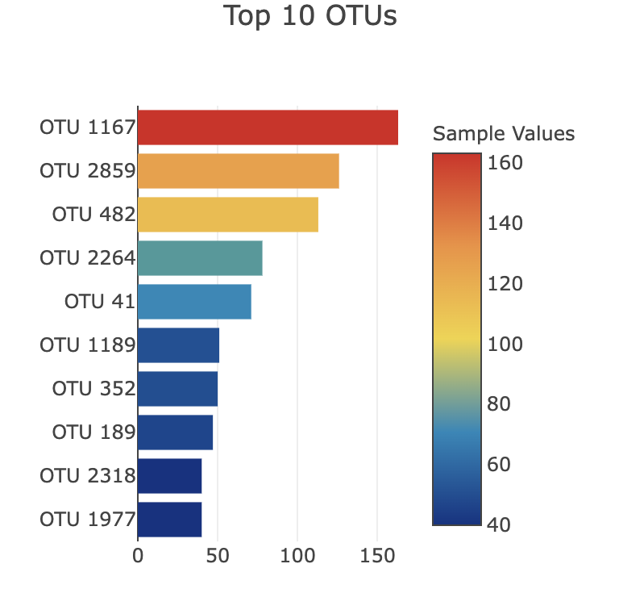
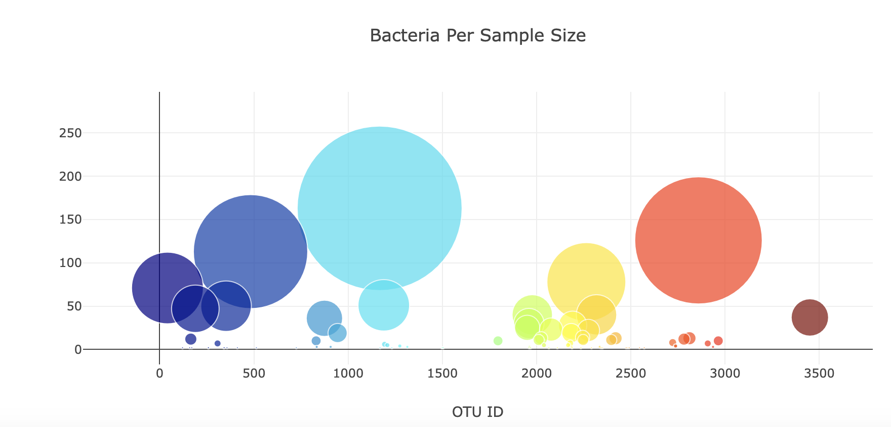

# belly-button-challenge
Belly-Button Challenge related files are in the repository

## Solution
In the belly-button-challenge folder, you will find the index.html and there is one folder called static, in which you will find a folder called js that has a file called 'app.js' which is the JavaScript code.

## Background
Build an interactive dashboard to explore the Belly Button Biodiversity datasetLinks to an external site., which catalogs the microbes that colonize human navels.

The dataset reveals that a small handful of microbial species (also called operational taxonomic units, or OTUs, in the study) were present in more than 70% of people, while the rest were relatively rare.

## Steps

1. Create a horizontal bar chart with a dropdown menu to display the top 10 OTUs found in that individual.

   

3. Create a bubble chart that displays each sample.

   

4. Display the sample metadata, i.e., an individual's demographic information.

